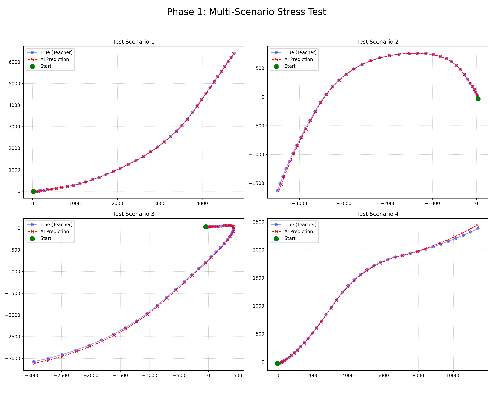

# 🚀 Learnable World Dynamics System

一个基于数据驱动的可学习物理动力学仿真引擎。本项目旨在通过深度学习方法，使 AI 在不硬编码特定物理公式（如 $F=ma$）的前提下，通过观察物体状态演化自行发现并模拟物理规律。

## 🎯 项目愿景 (Project Goal)

* **约束学习**：自主发现不可逾越的边界（如碰撞）。
* **动力学发现**：自行拟合力与运动之间的复杂非线性关系。
* **通用物理仿真**：具备模拟“异星物理”的潜力。

## 🚀 核心技术演进 (Evolutionary Path)

| 版本 | 技术定义 | 核心改进 | 解决的科学问题 |
| :--- | :--- | :--- | :--- |
| **V1.0** | 纯端到端映射 | 使用 vanilla MLP 直接学习状态跳转。 | 动力学基本建模。 |
| **V1.1** | 残差与特征解耦 | 引入残差架构学习变化量，剥离绝对坐标。 | 坐标依赖与平移不变性。 |
| **V1.5** | **可微积分器嵌入** | 显式集成**辛欧拉积分器 (Symplectic Euler)**。 | **运动学自相矛盾 (Kinematic Hallucination)**。 |

## 🧠 核心架构：灰盒模型 (Gray-Box Design)

在最新的 **V1.5** 版本中，我们实现了动力学与运动学的严格解耦：

1. **黑盒动力学**：神经网络仅负责预测加速度影响下的速度变化量 $\Delta v$。
2. **白盒运动学**：在计算图末端硬编码数学公理 $x_{t+1} = x_t + v_{t+1} \cdot dt$。

## 🧪 实验与验证 (Validation)

### 1. 运动学一致性测试 (KIR)

定义 **运动学自相矛盾率 (KIR)**：

$$KIR = \frac{1}{N} \sum \left\| \Delta x_{pred} - v_{pred} \cdot \Delta t \right\|^2$$

* **V1.5 (有先验)**：KIR 在数学上严格等于 0，确保了时空逻辑的绝对严谨。

### 2. 长期推演稳定性 (Long-term Rollout)

实验证明，在 10,000 步的连续推演中，系统依然能保持完美的匀速直线运动，无能量爆炸风险。

## 🖼️ 可视化结果 (Visualization)

这里插入你的仿真对比图：

## 📊 训练表现

在 Phase 1 的 15 步时序回归训练中，多步平均 Loss 最终稳定收敛至约 **12.3**。